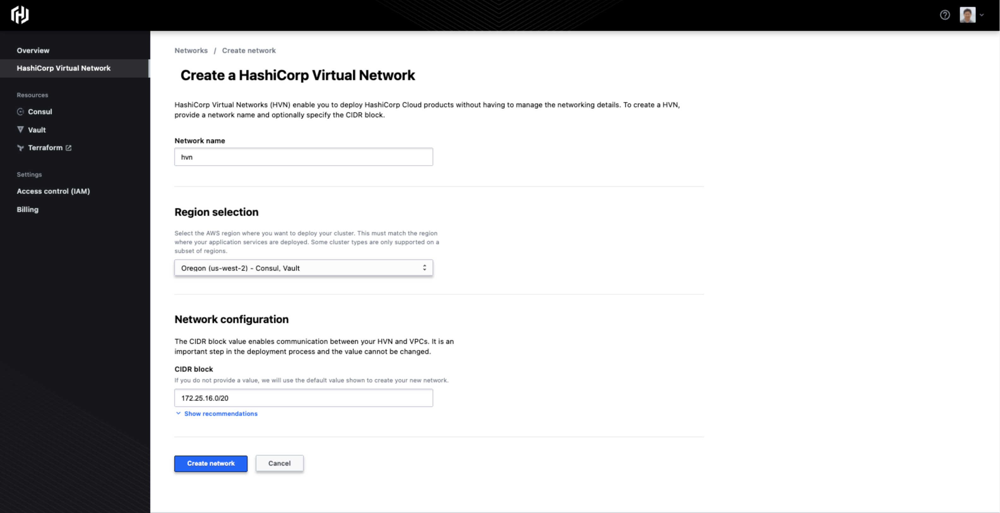
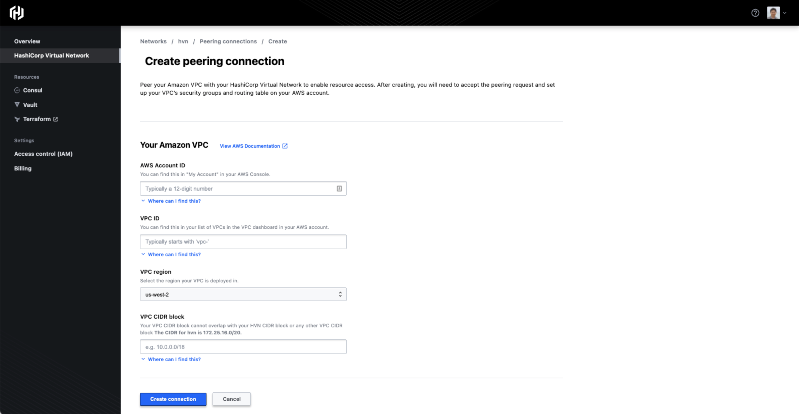
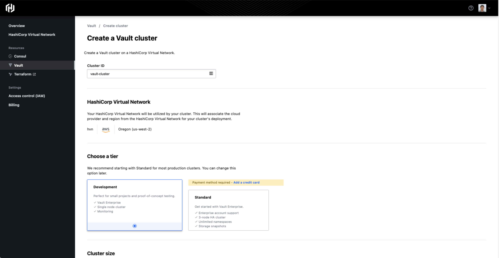
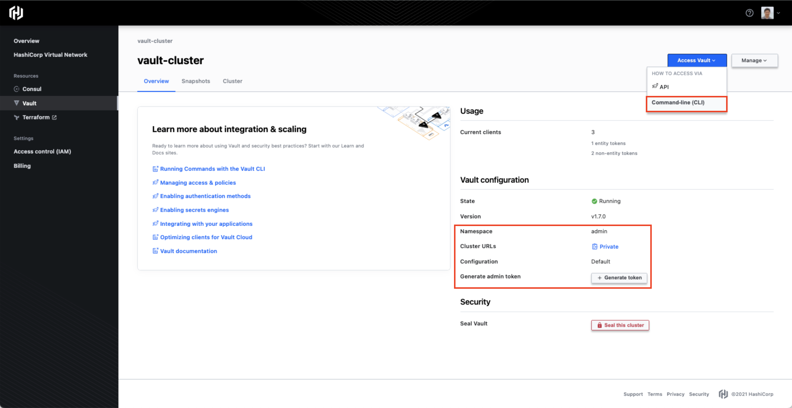
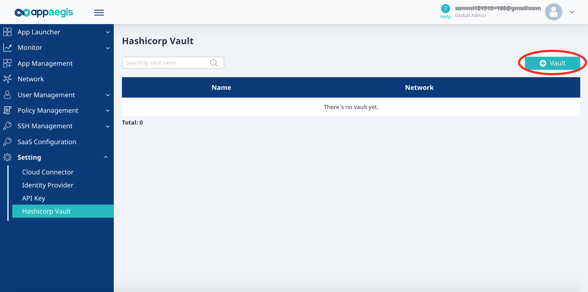
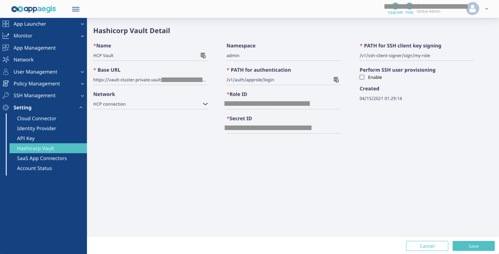
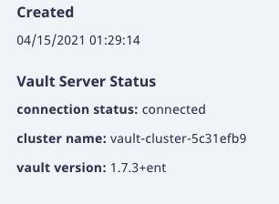
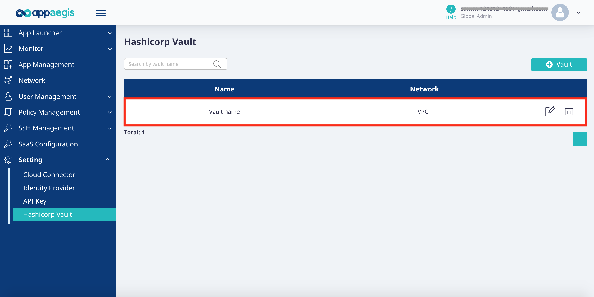
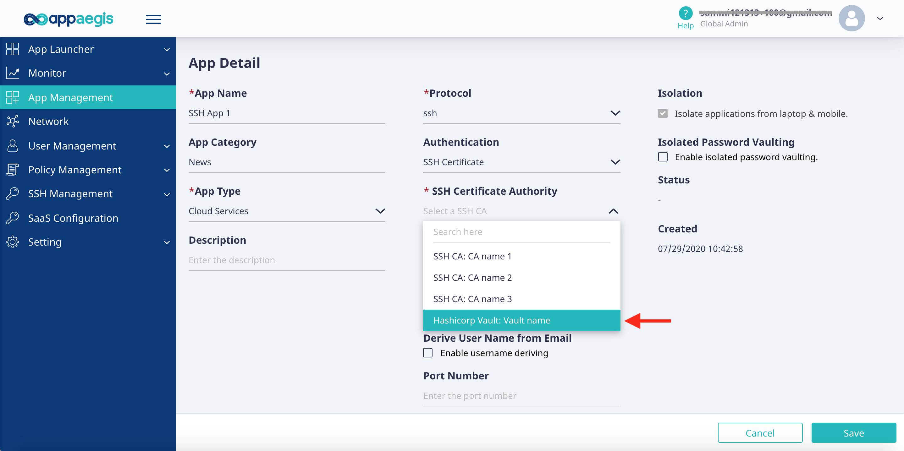

# Appaegis and HashiCorp Vault Integration

Appaegis zero trust access cloud allows agentless access to SSH servers with enhanced SSH security through MFA integration, file download control and instant access, eliminating management overhead. Integration with HashiCorp Vault enables simplified key management, streamlines credential management, eliminates shared SSH accounts, and allows dynamic provisioning.

With this integration, customers can securely store and manage SSH with Vault, and use Appaegis to provide seamless access and control for SSH server access.

After properly configure SSH secret engine in Vault, then the connectivity and access in Appaegis, the Vault can be used as a CA within Appaegis.

## Steps for Vault in HCP
If you need to connect to Vault in HCP, there are a few extra steps, please take a look of their document, such as https://www.hashicorp.com/blog/vault-on-the-hashicorp-cloud-platform-ga.

- Create HVN and peering with your VPC in AWS
- Create Network within Appaegis cloud and get it connected with your VPC
- Create Vault cluster
- Install Vault binary on a VM within the VPC that is peered with HVN
- On the VM setup environment variables before running Vault  
  *Hint: you can copy paste the lines from your HCP Vault cluster's page*

  ```sh
  export VAULT_ADDR="[Cluster URL]"
  export VAULT_NAMESPACE="admin"
  export VAULT_TOKEN=[Root token of the cluster]
  ```

<details><summary>HCP screenshots</summary>  

- Create HVN


- Create peering


- Create Vault cluster


- Vault cluster main view

</details>
<p></p>


## Configuration steps in Vault

Below steps are just for reference, you should further customize your deployment.

- Enable the "SSH client signer" engine and create a profile that can be used to sign cert for any user.

  ```sh
  vault secrets enable -path=ssh-client-signer ssh
  ```

  ```sh
  vault write ssh-client-signer/roles/my-role -<<"EOH"
  {
  "allow_user_certificates": true,
  "allowed_users": "*",
  "allowed_extensions": "permit-pty,permit-port-forwarding",
  "default_extensions": [
    {
      "permit-pty": ""
    }
  ],
  "key_type": "ca",
  "default_user": "ubuntu",
  "ttl": "60m0s",
  "algorithm_signer": "rsa-sha2-512"
  }
  EOH
  ```

- Generate a CA as the signing key, record the CA's public key.

  ```sh
  vault write ssh-client-signer/config/ca generate_signing_key=true
  ```

- Enable Approle authentication and add an admin user/profile, generate and record the RoleID and SecretID.

  ```sh
  vault auth enable approle
  ```

  ```sh
  # appaegis-pol.hcl
  path "ssh-client-signer/sign/my-role/*" {
    capabilities = [ "read", "list", "create", "update" ]
  }
  path "ssh-client-signer/sign/my-role" {
    capabilities = [ "read", "list", "create", "update" ]
  }
  ```

  ```sh
  vault policy write appaegis appaegis-pol.hcl
  vault write auth/approle/role/my-role token_num_uses=100 token_ttl=20m \
  token_max_ttl=30m token_policies="appaegis"
  ```

  ```sh
  # get role id
  vault read auth/approle/role/my-role/role-id
  # get secret id
  vault write -f auth/approle/role/my-role/secret-id
  ```

## Prepare SSH server

Change your `/etc/ssh/sshd_config` file to add a `TrustedUserCAKeys` option.
Then add a line into your `TrustedUserCAKeys` file, the content is the CA's public key. 
Make sure restart SSH server after modifing the `/etc/ssh/sshd_config` file.

  ```sh
  # If you don't have a line for the "TrustedUserCAKeys" option, add it to the /etc/ssh/sshd_config file:
  sudo sh -c 'echo "TrustedUserCAKeys /etc/ssh/trusted-user-ca-keys.pem" >> /etc/ssh/sshd_config'
  # Add the CA certificate's public key to this file so your SSH server can find it (replace with your public key and description):
  sudo sh -c 'echo "ssh-rsa AAAAB3Nz... [key description]" >> /etc/ssh/trusted-user-ca-keys1.pem'
  ```

## Configuration steps in Appaegis

Step 1

- Head over to Setting->HashiCorp Vault
- Click "+Vault" to create a Vault profile.



Step 2

- Enter the Vault information.
  - Base URL  
  This is the "Cluster URL" of your HCP Vault, or your Vault instance, in this format: http[s]://<vault-host>[:port][/path].  
  For example in most basic settings, the URL is usually https://myvault:8200. If your Vault server is accessble through a proxy or gateway, you need to make sure the port number and the optional path is setup correctly. If you need to debug your Vault integration, you can start with checking the URL
  - Network  
  The network you setup in order to reach your Vault server or the HCP Vault
  - Namespace  
  Needed for HCP Vault or Vault enterprise
  - PATH for authentication  
  Our example is "/v1/auth/approle/login". Your setting need to be consistent with the Vault authentication method you configured.
  - Role ID / Secret ID  
  When approle authentication is used, you need to provide these parameters
  - PATH for SSH client key signing  
  Our example is "/v1/ssh-client-signer/sign/my-role". Your setting need to be consistent with the Vault ssh-client-signer engine and role you configured.

- Click "Save".



- Check your Vault server connectivity  
After the Vault detail is saved, you may want to check has it been connected with Appaegis Cloud. Click the newly created Vault setting, you should see the connection status similar to below if it is reachable.  
If you need to debug this Vault integration, you can start with sending the authentication request manually, see this example copied from [HashiCorp document](https://www.vaultproject.io/docs/auth/approle#via-the-api).

  ```sh
  curl \
      --request POST \
      --data '{"role_id":"988a9df-...","secret_id":"37b74931..."}' \
      https://myvault:8200/v1/auth/approle/login
  ```



Step 3

- You will see the vault you created on the list.



Step 4

- Now you are able to select this vault as an SSH Certificate Authority when creating an SSH application.


