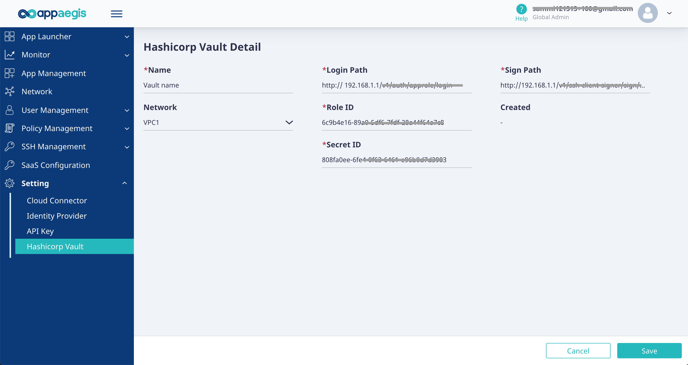

# Appaegis and Hashicorp Vault Integration
Appaegis zero trust access cloud allows agentless access to SSH servers with enhanced SSH security through MFA integration, file download control and instant access, eliminating management overhead. Integration with HashiCorp Vault enables simplified key management, streamlines credential management, eliminates shared SSH accounts, and allows dynamic provisioning.

With this integration, customers can securely store and manage SSH with Vault, and use Appaegis to provide seamless access and control for SSH server access.

After properly configure SSH secret engine in Vault, then the connectivity and access in Appaegis, the Vault can be used as a CA within Appaegis.

## Configuration steps in Vault
Below steps are just for reference, you should further customize your deployment.
* Enable Approle authentication and add an admin user/profile, generate and record the RoleID and SecretID.
* Enable the "SSH client signer" engine and create a profile that can be used to sign cert for any user.
* Generate a CA as the signing key, record the CA's public key.

## Prepare SSH server
Change your /etc/ssh/sshd_config file and specify a "TrustedUserCAKeys" file.
Add a line into your "TrustedUserCAKeys" file, the content is the CA's public key.

## Configuration steps in Appaegis

Step 1
* Head over to Setting->Hashicorp Vault
* Click "+Vault" to create a Vault profile. 

Step 2
* Enter the Vault information.
* Click "Save".

Step 3
* You will see the vault you created on the list.

Step 4
* Now you are able to select this vault as an SSH Certificate Authority when creating an SSH application.

